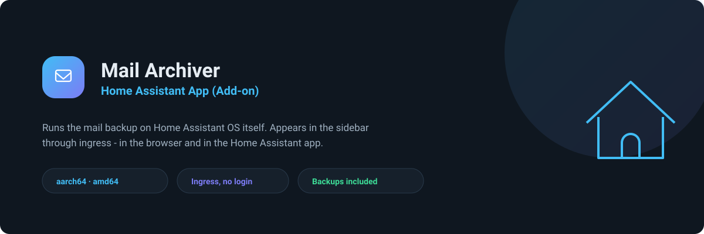
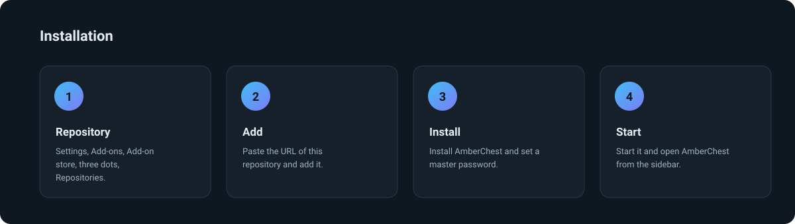
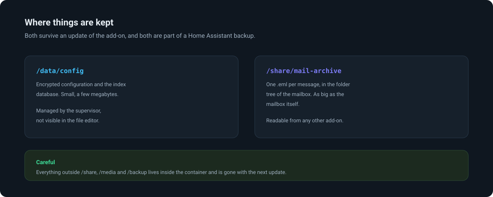
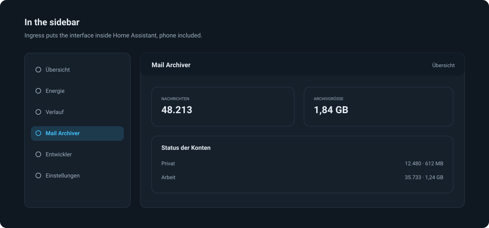

<div align="center">
  

  # AmberChest — IMAP Mail Backup Add-on for Home Assistant

  **Back up your mailboxes to files you own, from inside Home Assistant.**
  Add-on repository for [AmberChest — IMAP mail backup in plain .eml files](https://github.com/sphings79/amberchest):
  read only, incremental, nothing deleted on the server, nothing marked as read.

  [](https://www.home-assistant.io/addons/)
  [](https://github.com/sphings79/amberchest/releases)
  [](#requirements)
  [](LICENSE)

  **English** · [Deutsch](README.de.md)
</div>

## Table of contents

- [What this add-on does](#what-this-add-on-does)
- [Three projects, one archive](#three-projects-one-archive)
- [Installation](#installation)
- [Configuration](#configuration)
- [Where things are kept](#where-things-are-kept)
- [In the sidebar](#in-the-sidebar)
  - [Reaching it from outside](#reaching-it-from-outside)
- [How updates work](#how-updates-work)
- [Sensors and automations](#sensors-and-automations)
- [Requirements](#requirements)
- [Troubleshooting](#troubleshooting)
- [FAQ](#faq)
- [Credits](#credits)
- [Disclaimer](#disclaimer)
- [Licence](#licence)

## What this add-on does

AmberChest copies IMAP mailboxes to plain `.eml` files, one per message, in
the folder tree of the mailbox. It opens folders read only and fetches with
`BODY.PEEK`, so nothing is deleted and nothing is marked as read. This add-on
runs it on Home Assistant OS:

- **In the sidebar.** Ingress puts the interface inside Home Assistant, so it
  works in the browser and in the Home Assistant app on your phone.
- **No second login.** Home Assistant authenticates the user before the request
  arrives; the add-on answers the supervisor and refuses everything else.
- **Backed up with Home Assistant.** Configuration and archive live where the
  supervisor keeps them, so they survive updates and land in your backups.
- **On a schedule.** A cron expression in the options is all the automation it
  needs.

## Three projects, one archive

| | What it is |
| --- | --- |
| [**AmberChest**](https://github.com/sphings79/amberchest) | The application itself: desktop app for macOS, Windows and Linux, plus the Docker container this add-on runs |
| [**AmberChest Integration**](https://github.com/sphings79/amberchest-home-assistant) | Home Assistant integration from HACS: a device per mailbox, sensors, a backup button and a Lovelace card |
| **Home Assistant App (Add-on)** (here) | This repository: AmberChest on Home Assistant OS, in the sidebar through ingress |

The add-on and the integration work well together: the add-on runs the
instance, the integration turns it into entities.

## Installation



1. **Settings → Add-ons → Add-on store → ⋮ → Repositories**
2. Add `https://github.com/sphings79/amberchest-ha-app`
3. Install **AmberChest**
4. Set a **master password** under *Configuration*
5. Start it, then open **AmberChest** from the sidebar

[](https://my.home-assistant.io/redirect/supervisor_add_addon_repository/?repository_url=https%3A%2F%2Fgithub.com%2Fsphings79%2Famberchest-ha-app)

## Configuration

```yaml
master_password: choose-something-long
ui_password: ""
cron: "0 3 * * *"
cron_export_attachments: false
archive_path: /share/mail-archive
log_level: info
```

| Option | Meaning |
| --- | --- |
| `master_password` | Encrypts every mailbox password stored, with scrypt and AES-256-GCM. **Keep it** — without it the configuration cannot be opened again. |
| `ui_password` | Only needed to reach the interface from outside Home Assistant. Empty means sidebar only. |
| `cron` | Five fields: minute, hour, day of month, month, weekday. `0 3 * * *` is every night at three. Empty means no schedule. |
| `cron_export_attachments` | Runs the attachment export after every scheduled backup. |
| `archive_path` | Where the `.eml` files go. Must be below `/share`, `/media` or `/backup`. |
| `log_level` | `debug`, `info`, `warn` or `error`. |

## Where things are kept



| Path | Contents | Survives an update |
| --- | --- | --- |
| `/data/config` | encrypted configuration, index database | yes |
| `/share/mail-archive` | the archived mail | yes |

Both are part of a Home Assistant backup — which means the archive is too. If
that makes your backups unwieldy, put `archive_path` on a network share
mounted under `/media` and exclude it there.

## In the sidebar



Ingress needs no open port: Home Assistant proxies the interface itself, and
the add-on only answers that proxy.

### Reaching it from outside

Ingress is not an address other programs can talk to, so a browser on another
machine — or the AmberChest desktop app moving an archive over — needs the
port. Two settings on the **Configuration** tab:

1. Set `ui_password` under *Options*, the login the interface then asks for
2. Under *Network*, map port `8484` to the host

The interface then also answers at `http://homeassistant.local:8484`. Mapping
the port without the password changes nothing: without a login of its own the
add-on refuses everything that is not the supervisor, and says so in the log.

That address is what **Move** in the desktop app wants, which is how an archive
that started on a laptop ends up in Home Assistant.

**[→ Step by step, with pictures](docs/remote-access.md)** — both settings, the
restart, how to tell it worked, moving an archive over, and what to do when the
name does not resolve.

## How updates work

The add-on is a pointer at the AmberChest image, so an update is a version
number and nothing else. A workflow here checks hourly whether the application
has a newer release, makes sure the matching image is really published, and
writes the version into the add-on. Home Assistant then offers the update as
usual.

It pulls rather than being pushed to: a workflow token is only valid for its
own repository, so pushing from the application repository would need a
personal access token, and this needs no secret at all. To fetch a version
straight away, run **Follow AmberChest** under *Actions*.

> GitHub switches scheduled workflows off after 60 days without any commit in a
> repository. If nothing happened here for two months, run it once by hand.

## Sensors and automations

The interface is one thing, entities are another. Two ways, and they can run
side by side:

| | [Integration](https://github.com/sphings79/amberchest-home-assistant) | MQTT |
| --- | --- | --- |
| Installed through | HACS | nothing, it is built in |
| Needs an open port | yes, plus `ui_password` | no |
| Needs a broker | no | yes |
| Lovelace card | included | no |

MQTT is configured in the add-on itself, under **Home Assistant**: enter the
broker, and Home Assistant discovers a device per mailbox with messages,
archive size, last backup, a running flag and a backup button.

## Requirements

- Home Assistant OS or Supervised — add-ons do not exist on Container or Core.
  There, run the [Docker image](https://github.com/sphings79/amberchest#docker)
  directly.
- `aarch64` or `amd64`. There is no 32-bit build.
- Room for the archive: roughly what the mailbox occupies on the server.

## Troubleshooting

**It will not start.** The log says why. Without a master password it stops,
because it cannot open its own configuration.

**"Only reachable through Home Assistant".** That is the add-on refusing an
address that is not the supervisor. Set `ui_password` and map the port to open
it up.

**The archive vanished after an update.** `archive_path` pointed inside the
container. Use a folder below `/share`, `/media` or `/backup`.

**My backups became huge.** The archive sits in `/share` and is included. Move
it under `/media` on a network share and exclude that.

## FAQ

### Does this add-on delete anything on my mail server?

No. Folders are opened read only and messages are fetched with `BODY.PEEK`, so
even the "read" flag stays as it was. Deleting is not implemented at all.

### Can I read the archived mail without AmberChest?

Yes. Every message is a plain `.eml` file that Thunderbird, Apple Mail and
Outlook open directly. The folder tree on disk mirrors the mailbox.

### Does it work on a Raspberry Pi?

Yes, on a 64-bit installation. Mind the storage: an SD card is a poor place for
a 20 GB archive.

### Where do updates come from?

The add-on runs the published AmberChest image. A new version means a new
release there and a version bump here — the usual add-on update button.

### Is there a version for Home Assistant Container?

Add-ons only exist on Home Assistant OS and Supervised. On Container, run the
same image with `docker compose`; the
[main repository](https://github.com/sphings79/amberchest#docker) has the
file.

## Credits

[AmberChest — IMAP mail backup in plain .eml files](https://github.com/sphings79/amberchest)
by [sphings79](https://github.com/sphings79). This repository packages that
image as an add-on; the application itself lives there.

A ⭐ helps, and there is a [coffee](https://buymeacoffee.com/sphings) button.

## Disclaimer

Unofficial and community built. Not affiliated with or endorsed by the Open
Home Foundation or the Home Assistant project.

## Licence

AGPL-3.0-or-later, the same as AmberChest itself — see [LICENSE](LICENSE).

<sub>home assistant add-on · imap backup · email archive · mail backup home assistant ·
eml archive · self hosted mail backup · home assistant os add-on · ingress add-on</sub>
