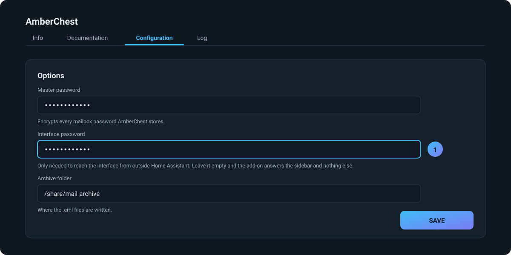
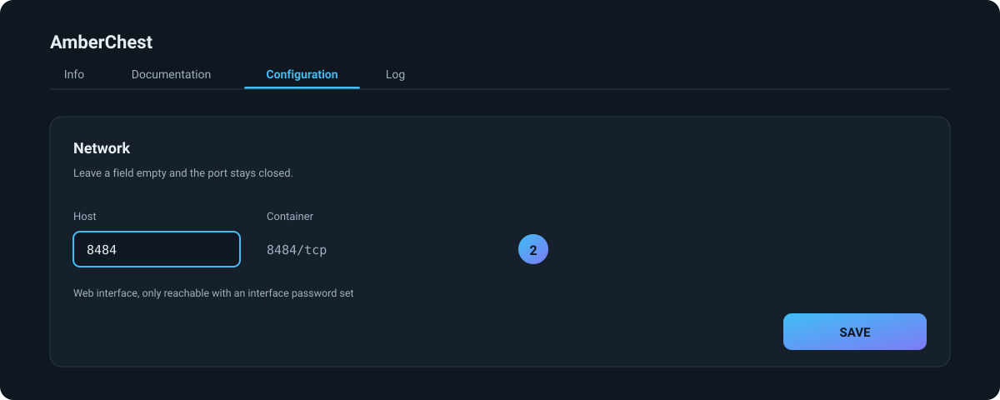

# Reaching the add-on from outside Home Assistant

[Deutsche Fassung](remote-access.de.md) · [Add-on README](../README.md)

Out of the box the add-on is reachable through the sidebar and nowhere else.
That is deliberate, and it is also the reason a few things do not work until
you change it — moving an archive over from the AmberChest desktop app, for
one.

This page is the whole procedure: two settings, one restart.

## Why it is closed to begin with

Ingress is the mechanism that puts the interface in the sidebar. Home Assistant
authenticates the user first and then proxies the page, so the add-on itself
has no login of its own — it does not need one, because only the supervisor can
reach it.

That last part is not a figure of speech. The add-on refuses every request that
does not come from the supervisor's address, and the log says so on every
start:

```
Running as a Home Assistant add-on: reachable through the sidebar, and only from the supervisor
```

Open the port without doing anything else and nothing changes: the requests
arrive and are answered with `403 Only reachable through Home Assistant`. The
password is what lifts that restriction, so it comes first.

## Step 1 — set an interface password

**Settings → Add-ons → AmberChest → Configuration**, under *Options*:



This is the password the interface will ask for. It is not the master password:
the master password unlocks the encrypted configuration inside, this one guards
the door. Use a different one.

Press **Save**.

## Step 2 — map the port

Same tab, further down, under *Network*:



Enter `8484` as the host port. Any free port works — `8484` just keeps the
address easy to remember.

Press **Save**.

## Step 3 — restart the add-on

The options are read at start, so the add-on has to come up again. **Restart**
on the add-on's Info tab.

The log now says:

```
Running as a Home Assistant add-on with an interface password of its own
```

That line is the confirmation. If it still mentions the supervisor, the
password did not get saved.

## Check it

Open `http://homeassistant.local:8484` in a browser on another machine. You
should get the AmberChest interface asking for the interface password.

The sidebar keeps working exactly as before, without a password — ingress is
unaffected by any of this.

## Moving an archive from the desktop app

This is what most people open the port for. An archive that grew up on a laptop
goes into the add-on like this:

1. In the add-on, create the account with the same mail address
2. In the desktop app, open the account and choose **Move**
3. Address: `http://homeassistant.local:8484`, password: the interface password
   from step 1
4. Pick the account on the other side and start

The files travel; the index does not. Every folder carries a journal, and the
add-on rebuilds its index from those — which is why an interrupted transfer is
harmless. Run it again and only what is still missing goes over, compared by
name and size.

Nothing is deleted on the laptop. Check the archive in the add-on, run one
backup there, and only then remove the old copy by hand.

## When it does not work

**The browser cannot find `homeassistant.local`.** That name comes from mDNS,
which some networks and some VPNs drop. Use the IP address of your Home
Assistant machine instead — `http://192.168.1.x:8484`.

**`403 Only reachable through Home Assistant`.** The password is empty. An
option that looks filled in but was never saved counts as empty; open the
Configuration tab again and check.

**The add-on will not start after mapping the port.** Something else on the
Home Assistant machine already listens on `8484`. Pick another host port; the
container port stays `8484`.

**The desktop app says the login failed.** It wants the *interface* password,
not the master password.

## One word on security

This is a plain HTTP port on your local network, protected by one password.
That is appropriate for a home network and nothing more.

Do not forward it through your router, and do not expose it to the internet. If
you need to get at the archive from outside, reach Home Assistant the way you
already do — through the app, Nabu Casa, or your VPN — and use the sidebar.
Ingress is behind Home Assistant's own authentication, which is a great deal
better than one password on an open port.

---

If this saved you an hour: a ⭐ on
[the add-on](https://github.com/sphings79/amberchest-ha-app) or
[AmberChest](https://github.com/sphings79/amberchest) helps, and there is
a [coffee](https://buymeacoffee.com/sphings) button as well.
